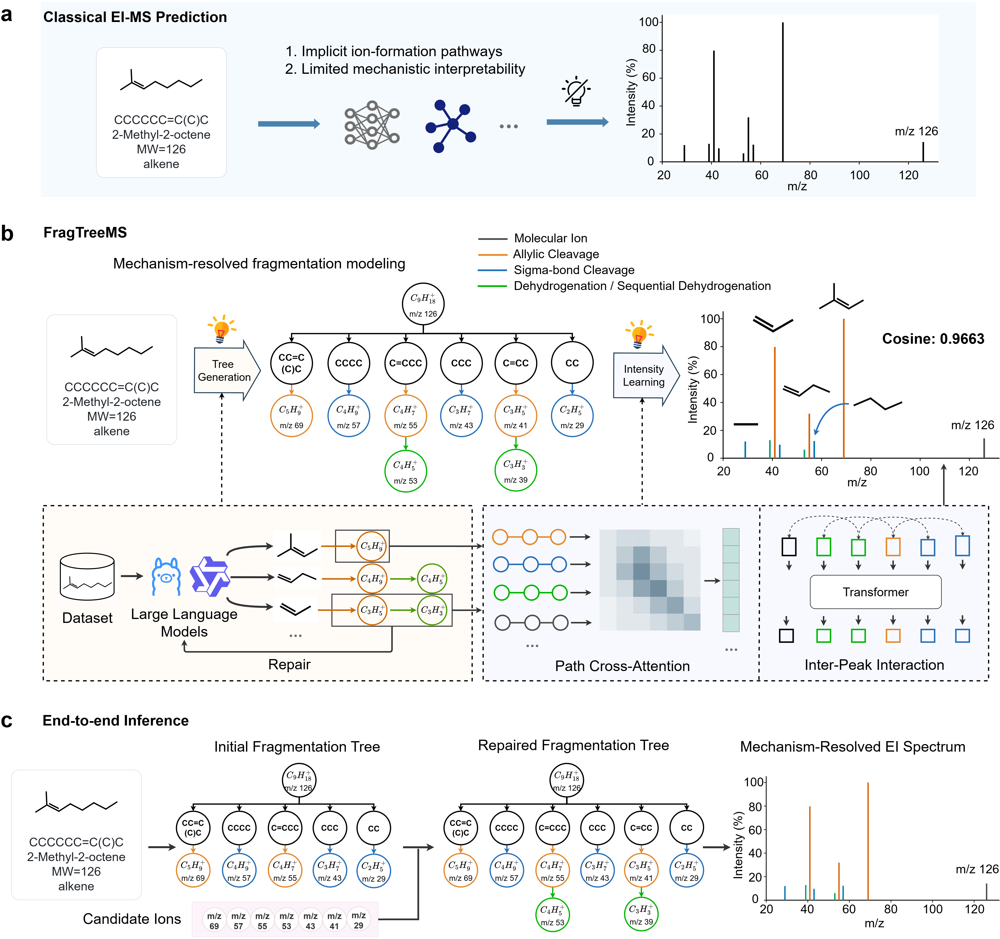
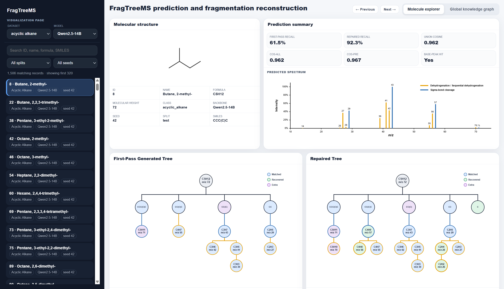

# FragTreeMS

FragTreeMS is a mechanism-grounded framework for interpretable electron ionization (EI) mass spectrum prediction. It generates and repairs explicit fragmentation trees and uses complete ion formation pathways to predict peak intensities.

<p align="center">
  
</p>

**Figure 1 | Conceptual overview of FragTreeMS.** Conventional structure-to-spectrum methods predict spectral patterns without explicitly representing the ion formation process. FragTreeMS instead organizes fragmentation chemistry as source-mechanism-product relations, repairs plausible omissions in the resulting tree and uses the complete pathway from the molecular root to each product ion for intensity prediction.

## Overview

Most computational approaches formulate EI mass spectrum prediction as a direct mapping from molecular structure to peak intensity. Although such models can reproduce spectral patterns, the chemical processes that connect a molecule to its product ions remain implicit.

FragTreeMS introduces an explicit intermediate representation. For each molecule, the framework constructs an fragmentation tree composed of source-mechanism-product relations. A source can be a structural fragment or an observed precursor ion, the mechanism is selected from a controlled EI fragmentation vocabulary, and the product records the ion formula and nominal mass. Candidate-guided self-review then identifies and repairs plausible omissions before intensity modelling.

The repaired tree is not used only as a post hoc explanation. The complete pathway from the molecular root to each retained product ion enters the intensity model directly. Path Cross-Attention encodes the ion-specific formation history, and Inter-Peak Interaction models dependencies among the retained ions before non-negative, base-peak-normalized intensities are predicted.

## Method workflow

1. **Annotation curation.** Initial mechanism annotations are generated with GPT-4.1, refined in a second GPT-4.1 pass, completed and corrected with GPT-5, and then reviewed manually. The released annotations are therefore curated records rather than unreviewed model outputs.
2. **Fragmentation tree reasoning and repair.** A language model first generates a fragmentation tree containing the predicted ion inventory, structural fragments, relations between precursor and product ions and mechanism labels. Diagnostic ion candidates then guide a self-review pass that recovers plausible omissions while preserving the explicit tree structure.
3. **Intensity prediction.** The repaired tree and its complete ion formation pathways are encoded to predict normalized EI peak intensities.


## Repository structure

```text
FragTreeMS/
├── annotation_pipeline/
│   ├── generation/
│   ├── refinement/
│   └── finalization/
├── stage1_tree_generation/
├── stage2_intensity_prediction/
├── data/
│   ├── acyclic_alkane_data/
│   ├── alkene_data/
│   ├── cycloalkane_data/
│   └── aromatic_hydrocarbon_data/
├── Images/
├── README.md
└── requirements.txt
```

| Directory                      | Description                                                  |
| ------------------------------ | ------------------------------------------------------------ |
| `annotation_pipeline/`         | Scripts for initial annotation generation, refinement and final correction. |
| `stage1_tree_generation/`      | Training and inference code for fragmentation tree generation and self-review repair. |
| `stage2_intensity_prediction/` | Training and inference code for pathway-conditioned intensity prediction. |
| `data/`                        | Example of annotated data format. |
| `Images/`                      | Images for this project. |

## Current scope

The mechanism vocabulary included in this release spans the principal ion formation and fragmentation processes commonly observed in EI mass spectrometry. The datasets used to validate the framework focus on 70 eV electron ionization (EI) mass spectra from four hydrocarbon classes: acyclic alkanes, alkenes, cycloalkanes and aromatic hydrocarbons.

The tree reasoning experiments use Qwen3-8B, Llama3.1-8B-Instruct and Qwen2.5-14B-Instruct as alternative backbone models. The intensity model uses the same pathway representation and evaluation protocol across backbones.

## Visualization

FragTreeMS provides molecule-level visualizations of the inferred fragmentation tree, repaired product ions, complete formation pathways and predicted EI spectrum. The interactive demonstration is available at [https://pec.cup.edu.cn/FragTreeMS](https://pec.cup.edu.cn/FragTreeMS).


