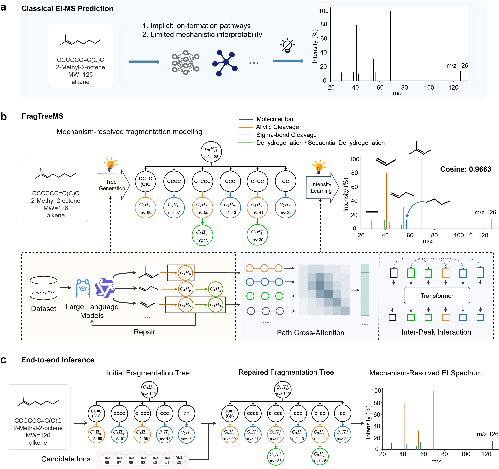

# FragTreeMS

FragTreeMS is a mechanism-grounded framework for interpretable electron ionization (EI) mass spectrum prediction. It generates and repairs explicit fragmentation trees and uses complete ion formation pathways to predict peak intensities.



**Figure 1 | Conceptual overview of FragTreeMS.** Conventional structure-to-spectrum methods predict spectral patterns without explicitly representing the ion formation process. FragTreeMS instead organizes fragmentation chemistry as source-mechanism-product relations, repairs plausible omissions in the resulting tree and uses the complete pathway from the molecular root to each product ion for intensity prediction.

## Overview

Most computational approaches formulate EI mass spectrum prediction as a direct mapping from molecular structure to peak intensity. Although such models can reproduce spectral patterns, the chemical processes that connect a molecule to its product ions remain implicit.

FragTreeMS introduces an explicit intermediate representation. For each molecule, the framework constructs an ion-first fragmentation tree composed of source-mechanism-product relations. A source can be a structural fragment or an observed precursor ion, the mechanism is selected from a controlled EI fragmentation vocabulary, and the product records the ion formula and nominal mass. Candidate-guided self-review then identifies and repairs plausible omissions before intensity modelling.

The repaired tree is not used only as a post hoc explanation. The complete pathway from the molecular root to each retained product ion enters the intensity model directly. Path Cross-Attention encodes the ion-specific formation history, and Inter-Peak Interaction models dependencies among the retained ions before non-negative, base-peak-normalized intensities are predicted.

## Main features

- **Explicit fragmentation reasoning.** Product ions are represented through traceable source, mechanism and product relations rather than only as predicted masses.
- **Recall-oriented tree repair.** Candidate-guided self-review recovers plausible missing ions and incomplete branches before intensity prediction.
- **Pathway-conditioned intensity modelling.** Complete root-to-ion pathways contribute directly to quantitative intensity assignment.
- **Inspectable predictions.** Each predicted peak can be linked to a putative structural fragment, precursor relation, mechanism and formation pathway.
- **Controlled evaluation.** The same molecule-level partitions and evaluation definitions are used across backbone models and matched baselines.

## Method workflow

1. **Annotation curation.** Initial mechanism annotations are generated with GPT-4.1, refined in a second GPT-4.1 pass, completed and corrected with GPT-5, and then reviewed manually. The released annotations are therefore curated records rather than unreviewed model outputs.
2. **Fragmentation tree reasoning.** A language model generates an initial fragmentation tree containing the predicted ion inventory, structural fragments, precursor-product transitions and mechanism labels.
3. **Self-review repair.** Diagnostic ion candidates guide a second reasoning pass that recovers plausible omissions while preserving the explicit tree structure.
4. **Intensity prediction.** The repaired tree and its complete ion formation pathways are encoded to predict normalized EI peak intensities.

## Repository structure

```text
FragTreeMS/
├── annotation_pipeline/
│   ├── 01_generation/
│   ├── 02_refinement/
│   └── 03_finalization/
├── stage1_tree_reasoning/
├── stage2_intensity_prediction/
├── data/
├── visualization/
├── Figure1.png
└── README.md
```

| Directory                      | Description                                                  |
| ------------------------------ | ------------------------------------------------------------ |
| `annotation_pipeline/`         | Scripts for initial annotation generation, refinement and final correction. |
| `stage1_tree_reasoning/`       | Training and inference code for fragmentation tree generation and self-review repair. |
| `stage2_intensity_prediction/` | Training and inference code for pathway-conditioned intensity prediction. |
| `data/`                        | Redistributable annotations, molecule-level partitions and data-format examples. |
| `visualization/`               | Tools for inspecting fragmentation trees, ion pathways and predicted spectra. |

## Current scope

The current release focuses on nominal-mass 70 eV EI spectra from four hydrocarbon classes: acyclic alkanes, alkenes, cycloalkanes and aromatic hydrocarbons. Fragmentation annotations use a controlled vocabulary of 13 ion formation and fragmentation processes. These assignments provide chemically plausible explanations at nominal-mass resolution; they do not claim a unique microscopic gas-phase trajectory when several routes are compatible with an observed ion.

The tree reasoning experiments use Qwen3-8B, Llama3.1-8B-Instruct and Qwen2.5-14B-Instruct as alternative backbone models. The intensity model uses the same pathway representation and evaluation protocol across backbones.

## Data availability

Project data that the authors are permitted to redistribute, including the curated annotations of fragmentation mechanisms and the random partitioning scheme applied at the molecule level, are provided in the `data/` directory. Reference EI spectra originate from the NIST 20 Mass Spectral Library and are not redistributed because they are subject to the corresponding license. Users must obtain licensed NIST data separately before reproducing experiments that require the original spectra.

No API credentials, access tokens or licensed third-party data are included in this repository.

## Evaluation and reproducibility

Molecules are randomly partitioned at the molecule level into training and test sets at a 9:1 ratio using a fixed partition seed. Training is repeated with seeds 42, 43 and 44. Metrics are macro-averaged across molecules within each run and summarized using the arithmetic mean and sample standard deviation across runs. For overall comparisons, each metric is first averaged equally across the four molecular classes within each seed, after which the mean and standard deviation are calculated across the three seeds.

Reported endpoints include product-ion recovery, Base-peak Accuracy, Cos-Pre, Cos-All, complete-spectrum Cosine similarity and Ion Recall@5. Exact metric definitions, mass-matching rules and aggregation conventions are described in the accompanying manuscript and Supplementary Information.

## Visualization

FragTreeMS provides molecule-level visualizations of the inferred fragmentation tree, repaired product ions, complete formation pathways and predicted EI spectrum. The interactive demonstration is available at [https://pec.cup.edu.cn/FragTreeMS](https://pec.cup.edu.cn/FragTreeMS).

## Citation

If you use FragTreeMS, its annotations or its evaluation protocol, please cite the accompanying manuscript:

> *Mechanism-grounded fragmentation trees enable explicit chemical reasoning for electron ionization mass spectrum prediction.*

Complete citation metadata and a BibTeX entry will be added when a persistent publication identifier becomes available.

## License

Source-code licensing and data-use terms are provided separately in `LICENSE` and `data/README.md`. The NIST 20 Mass Spectral Library remains subject to its original license and distribution restrictions.

## Contact

Questions, reproducibility reports and bug reports can be submitted through the GitHub issue tracker.
