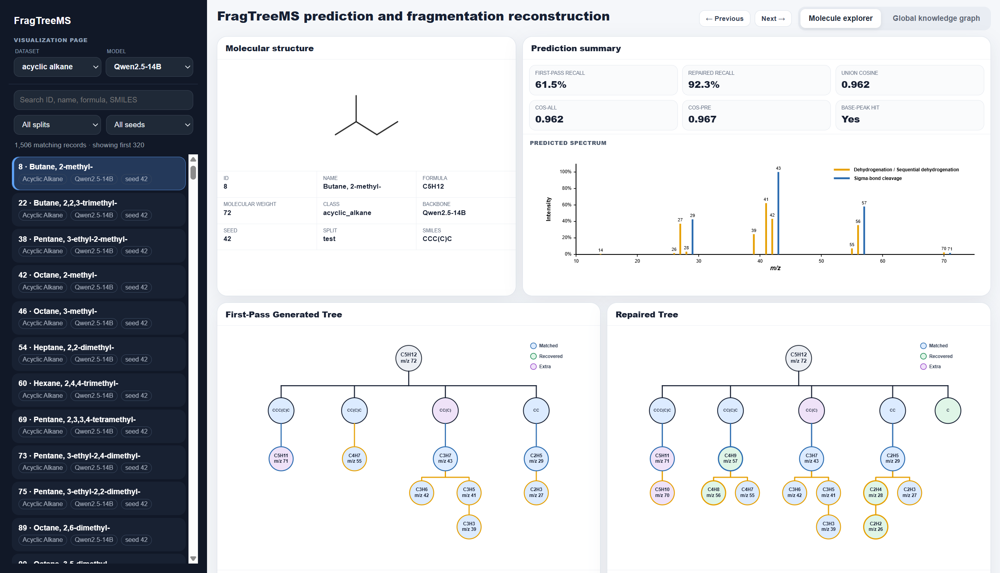

<h1 align="center">FragTreeMS</h1>

<p align="center">
  <strong><em>Mechanism-grounded fragmentation trees enable explicit chemical reasoning for electron ionization mass spectrum prediction</em></strong>
</p>

<p align="center">
  <a href="#overview">Overview</a> &nbsp;·&nbsp;
  <a href="#method-workflow">Method</a> &nbsp;·&nbsp;
  <a href="#visualization">Interactive demo</a> &nbsp;·&nbsp;
  <a href="#chs-benchmark-and-results">CHS results</a>
</p>

<p align="center"><strong>🧪 New experiment: We add a CHS benchmark beyond the four hydrocarbon classes; results are presented in the final section.</strong></p>

## Overview

FragTreeMS represents each product ion as a source-mechanism-product relation in an explicit fragmentation tree. Candidate-guided review repairs missing ions and pathways; the complete molecular-to-ion pathway then conditions intensity prediction through Path Cross-Attention and Inter-Peak Interaction.

<p align="center">
  <a href="./Images/Main.pdf">
    
  </a>
</p>

<p align="center">
  <strong>Figure 1 | Overview of the FragTreeMS framework.</strong>

</p>

## Method workflow

1. **Annotation curation.** Initial mechanism annotations are generated with GPT-4.1, refined in a second GPT-4.1 pass, completed and corrected with GPT-5, and then reviewed manually. The released annotations are therefore curated records rather than unreviewed model outputs.
2. **Fragmentation tree reasoning and repair.** A language model first generates a fragmentation tree containing the predicted ion inventory, structural fragments, relations between precursor and product ions and mechanism labels. Diagnostic ion candidates then guide a self-review pass that recovers plausible omissions while preserving the explicit tree structure.
3. **Intensity prediction.** The repaired tree and its complete ion formation pathways are encoded to predict normalized EI peak intensities.

## Repository structure

```text
FragTreeMS/
├── annotation_pipeline/
│   ├── generation/
│   ├── refinement/
│   └── finalization/
├── stage1_tree_generation/
├── stage2_intensity_prediction/
├── data/
│   ├── acyclic_alkane_data/
│   ├── alkene_data/
│   ├── cycloalkane_data/
│   └── aromatic_hydrocarbon_data/
├── Images/
├── README.md
└── requirements.txt
```

| Directory | Description |
| --- | --- |
| `annotation_pipeline/` | Scripts for initial annotation generation, refinement and final correction. |
| `stage1_tree_generation/` | Training and inference code for fragmentation tree generation and self-review repair. |
| `stage2_intensity_prediction/` | Training and inference code for pathway-conditioned intensity prediction. |
| `data/` | Example of annotated data format. |
| `Images/` | Images for this project. |

## Current scope

The mechanism vocabulary included in this release spans the principal ion formation and fragmentation processes commonly observed in EI mass spectrometry. The main validation datasets focus on 70 eV electron ionization (EI) mass spectra from four hydrocarbon classes: acyclic alkanes, alkenes, cycloalkanes and aromatic hydrocarbons. A supplementary CHS evaluation extends the reported benchmark to sulfur-containing molecules; its results and a worked example are presented at the top of this README.

The tree reasoning experiments use Qwen3-8B, Llama3.1-8B-Instruct and Qwen2.5-14B-Instruct as alternative backbone models. The intensity model uses the same pathway representation and evaluation protocol across backbones.

## Visualization

FragTreeMS provides molecule-level visualizations of the inferred fragmentation tree, repaired product ions, complete formation pathways and predicted EI spectrum. The interactive demonstration is available at [https://pec.cup.edu.cn/FragTreeMS](https://pec.cup.edu.cn/FragTreeMS).



## CHS benchmark and results

**A sulfur-containing evaluation beyond the four hydrocarbon classes.** The CHS results below compare direct spectrum prediction, triplet-based input, baseline predictors and the full FragTreeMS model.

<p align="center">
  <a href="./Images/Figures-S1.pdf">
    
  </a>
</p>

<p align="center">
  <strong>Figure S1 | A representative CHS molecule and its EI spectrum, mechanism-coloured fragmentation tree and assigned ion pathways.</strong>

</p>

### CHS spectrum-prediction results

<p><strong>Direct versus triplet-input settings.</strong> Base-peak accuracy and cosine similarity are shown side by side for each backbone.</p>

<table width="100%" cellpadding="3" cellspacing="0">
<thead>
<tr>
<th><small>System / model</small></th>
<th align="center"><small>Direct · base-peak</small></th>
<th align="center"><small>Direct · cosine</small></th>
<th align="center"><small>Triplets · base-peak</small></th>
<th align="center"><small>Triplets · cosine</small></th>
</tr>
</thead>
<tbody>
<tr><td><small>GPT · GPT-5.5</small></td><td align="center"><small>0.320261 ± 0.019608</small></td><td align="center"><small>0.580188 ± 0.011335</small></td><td align="center"><small>0.278867 ± 0.003774</small></td><td align="center"><small>0.554586 ± 0.001029</small></td></tr>
<tr><td><small>DeepSeek · DeepSeek-V4-Pro</small></td><td align="center"><small>0.455338 ± 0.021010</small></td><td align="center"><small>0.652453 ± 0.003365</small></td><td align="center"><small>0.411765 ± 0.006536</small></td><td align="center"><small>0.622592 ± 0.004737</small></td></tr>
<tr><td><small>Local · Qwen3-8B</small></td><td align="center"><small>0.039216 ± 0.006536</small></td><td align="center"><small>0.123006 ± 0.004331</small></td><td align="center"><small>0.209150 ± 0.013072</small></td><td align="center"><small>0.190229 ± 0.001188</small></td></tr>
<tr><td><small>Local · Llama3.1-8B</small></td><td align="center"><small>0.023965 ± 0.013606</small></td><td align="center"><small>0.105070 ± 0.004642</small></td><td align="center"><small>0.067538 ± 0.007547</small></td><td align="center"><small>0.153230 ± 0.005393</small></td></tr>
<tr><td><small>Local · Qwen2.5-14B</small></td><td align="center"><small>0.028322 ± 0.003774</small></td><td align="center"><small>0.122590 ± 0.005339</small></td><td align="center"><small>0.034858 ± 0.007547</small></td><td align="center"><small>0.113549 ± 0.006863</small></td></tr>
</tbody>
</table>

<p><strong>Baselines and full-model results.</strong></p>

<table width="100%" cellpadding="3" cellspacing="0">
<thead>
<tr>
<th><small>System</small></th>
<th><small>Model / setting</small></th>
<th align="center"><small>Base-peak accuracy</small></th>
<th align="center"><small>Cosine</small></th>
</tr>
</thead>
<tbody>
<tr><td><small>Baseline</small></td><td><small>NEIMS</small></td><td align="center"><small>0.457516 ± 0.017292</small></td><td align="center"><small>0.737847 ± 0.001619</small></td></tr>
<tr><td><small>Baseline</small></td><td><small>CFM-ID</small></td><td align="center"><small>0.294118 ± 0.000000</small></td><td align="center"><small>0.528892 ± 0.000000</small></td></tr>
<tr><td><small>FragTreeMS</small></td><td><small>Qwen3-8B · Full model</small></td><td align="center"><small>—</small></td><td align="center"><small>—</small></td></tr>
<tr><td><small>FragTreeMS</small></td><td><small>Llama3.1-8B · Full model</small></td><td align="center"><small>0.468410 ± 0.013606</small></td><td align="center"><small>0.741180 ± 0.003364</small></td></tr>
<tr><td><small>FragTreeMS</small></td><td><small>Qwen2.5-14B · Full model</small></td><td align="center"><small>—</small></td><td align="center"><small>—</small></td></tr>
</tbody>
</table>
